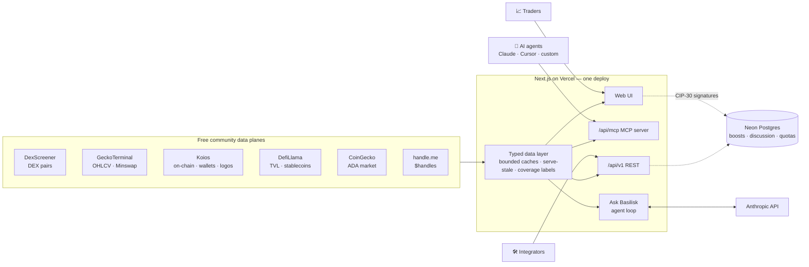
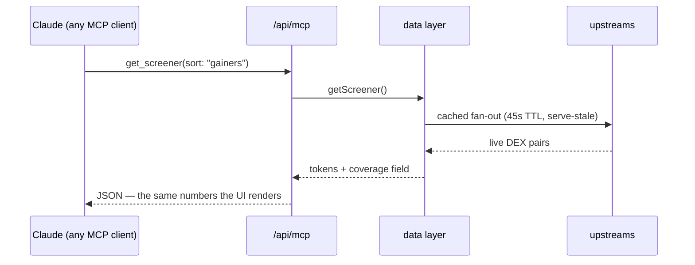

<div align="center">

# 🐍 Basilisk

**The Cardano terminal for humans _and_ AI agents.**

Real-time DEX screener · token analytics with pro charts · wallet intelligence · community boosts · free public API · the first hosted MCP server for Cardano market data.

[](https://github.com/wbaxterh/basilisk/actions/workflows/ci.yml)
[](https://basilisk-seven.vercel.app)
[](LICENSE)
[](apps/web)
[](tsconfig.base.json)
[](https://cardano.org)
[](https://basilisk-docs.vercel.app/docs/agents/mcp)
[](CONTRIBUTING.md)

[**Live app**](https://basilisk-seven.vercel.app) · [**Docs**](https://basilisk-docs.vercel.app) · [**API**](https://basilisk-seven.vercel.app/api/v1) · [**For agents**](https://basilisk-seven.vercel.app/agents) · [**Contributing**](CONTRIBUTING.md)

</div>

---

TapTools shut down in June 2026 and left Cardano without its analytics terminal. Basilisk is the successor — rebuilt on sustainable community rails (Koios, DexScreener, GeckoTerminal, DefiLlama), free with no NFT passes, and **agent-native from day one**: every number a human sees in the UI is available to AI agents through the same public API and a hosted [MCP server](https://basilisk-docs.vercel.app/docs/agents/mcp).

```bash
# Humans: open the app
open https://basilisk-seven.vercel.app/screener

# Agents: one line to give Claude a Cardano terminal
claude mcp add --transport http basilisk https://basilisk-seven.vercel.app/api/mcp

# Developers: free JSON API, no key required
curl https://basilisk-seven.vercel.app/api/v1/tokens
```

## ✨ What's live

| Surface | What you get |
|---|---|
| **Screener** | Live DEX pairs aggregated per token — price, 1H/6H/24H, liquidity, buy/sell pressure, Trending (community boosts), Favorites |
| **Token pages** | Candlestick charts (1m→1W, USD/₳, price/FDV, log scale, EMA/SMA, **drawing tools**), per-pool breakdown, holders, in-app trading via DexHunter |
| **Portfolio** | Any `$handle` / `addr1` / `stake1` — holdings, USD values, allocation. No login |
| **DeFi scoreboard** | Cardano TVL, stablecoins, top protocols + the ₳120M PRIME program tracker |
| **Community** | One free boost per wallet per day (never pay-to-play) + wallet-signed token discussions |
| **Ask Basilisk** | In-app AI analyst answering from live data via tool calls |
| **`/api/v1`** | Free public REST API — the same data plane the UI uses |
| **`/api/mcp`** | Hosted MCP server: `search_tokens` · `get_screener` · `get_token` · `get_wallet` · `get_ada_price` · `get_chain_tip` |

**Honesty first:** every aggregate carries a `coverage` field (DEX data: SundaeSwap + WingRiders via DexScreener · Minswap + SaturnSwap via GeckoTerminal). Nothing is ever labeled "total Cardano volume." Architecture decisions are recorded as [ADRs](docs/adr/).

## 🏗 Architecture

Zero-infra by design ([ADR-002](docs/adr/002-public-free-data-architecture.md), [ADR-003](docs/adr/003-api-v1-from-nextjs-routes.md)): free community data planes behind one typed, cached data layer, served through Next.js on Vercel — one deploy powers the UI, the REST API, the MCP server, and the in-app agent.



The same six tool functions serve four consumers — that's the core design bet:



## 🚀 Quick start

```bash
nvm use               # Node 20.18+
npm install           # npm workspaces
npm run dev:web       # http://localhost:3000
```

No env vars are needed for the core features — screener, token pages, charts, portfolio, and the DeFi scoreboard run entirely on free public APIs. Optional extras: `DATABASE_URL` (Neon — boosts/discussion/waitlist), `ANTHROPIC_API_KEY` (Ask Basilisk), `COINGECKO_DEMO_KEY`, `NEXT_PUBLIC_DEXHUNTER_PARTNER`. See [`.env.example`](.env.example) — never commit secrets.

## 🗂 Repo layout

```
apps/web/          Next.js 15 app — UI + /api/v1 + /api/mcp + agent   (everything live runs here)
apps/docs/         Docusaurus docs site → basilisk-docs.vercel.app
apps/api-gateway/  Fastify gateway (Phase-1 scaffold, unhosted — ADR-003)
services/          Indexer-era scaffolds: ingestion · pricing · alerts · portfolio   (issue #85)
packages/          Shared types + chain-data providers
docs/adr/          Architecture Decision Records 001–008
docs/              Whitepaper · MVP plan · infra brief · launch content
```

## 🗺 Roadmap

Tracked in [issues](https://github.com/wbaxterh/basilisk/issues). The open backlog is gated on four infrastructure decisions detailed in the [Infrastructure & Scale-Up Brief](docs/INFRA_BRIEF_V07.md): the **DEX indexer** ([#85](https://github.com/wbaxterh/basilisk/issues/85) — live trades, sub-minute candles, cross-DEX truth), **accounts/auth**, **notifications delivery**, and **API monetization** (keys/tiers + x402 for agents).

## 🤝 Contributing

Contributions are welcome — start with the [**Contribution Guide**](CONTRIBUTING.md) and [Code of Conduct](CODE_OF_CONDUCT.md).

- Branch from `main` (`feat/…`, `fix/…`, `docs/…`) and open a PR. CI (`build`) must pass; [@wbaxterh](https://github.com/wbaxterh) reviews every PR via [CODEOWNERS](.github/CODEOWNERS).
- Look for [`help wanted`](https://github.com/wbaxterh/basilisk/labels/help%20wanted) and [`good first issue`](https://github.com/wbaxterh/basilisk/labels/good%20first%20issue) labels.
- **Security issues:** please follow [SECURITY.md](.github/SECURITY.md) instead of opening a public issue.

## 📄 License

[MIT](LICENSE) © 2026 Wes Huber
